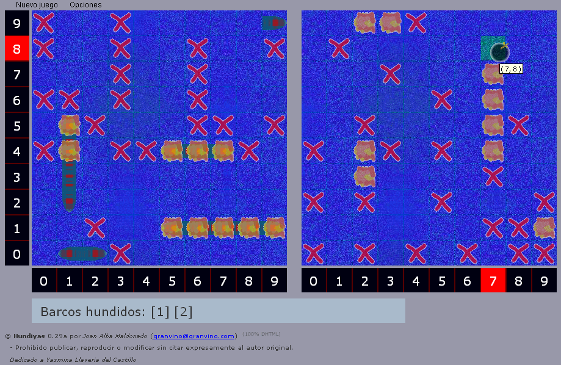

Hundiyas 
========= 
by Joan Alba Maldonado (joanalbamaldonadoNO_SPAM_PLEASE AT gmail DOT com, without NO_SPAM_PLEASE)

Battleship alike game totally written in DHTML.

Version: 0.29a 
- Date: 12th June 2007 (approximately).

You can donate at http://sourceforge.net/project/project_donations.php?group_id=198303

## Description

Open source Battleship (aka Battleships or Sea Battle) game totally written in DHTML (HTML, CSS and JavaScript). Highly configurable.

It is my eighth DHTML game and was made in mid 2007.

Players can configure the game with many options. For instance, you can change board size, decide whether to allow bombing same cell more than once or not, whether to allow to place two ships next to each other without any space between them or not, whether to mark already bombed cells or not, decide who will start playing first and choose among three difficulty levels (easy, normal and hard) that will change the AI (Artificial Intelligence) of the game.

You can also change the game behaviour easily by editing many of the configuration variables which are at the beginning of the script. To change the game images you just need to replace them with others.

Official languages are Spanish and English.

You can find other modified and adapted versions of this game on the Internet, including one Opera widget.

This game has been tested under BeOS, Linux, NetBSD, OpenBSD, FreeBSD, Windows, Mac OS X, BlackBerry Tablet OS, Android, iOS and others.

Play online in English: http://hundiyas.tuxfamily.org/hundiyas_english/

Play online in English (mirror): http://www.dhtmlgames.com/hundiyas/hundiyas_english/

Play online in Spanish: http://hundiyas.tuxfamily.org/hundiyas_spanish/

Play online in Spanish (mirror): http://www.dhtmlgames.com/hundiyas/hundiyas_spanish/

Official web site: http://hundiyas.tuxfamily.org/ (mirror at http://www.dhtmlgames.com/hundiyas/).

## License

This project can be used, reproduced, distributed and modified freely for any non-commercial purposes but always keeping the author's name and copyright clauses. Other than that, just use this project as you wish but never sell it!